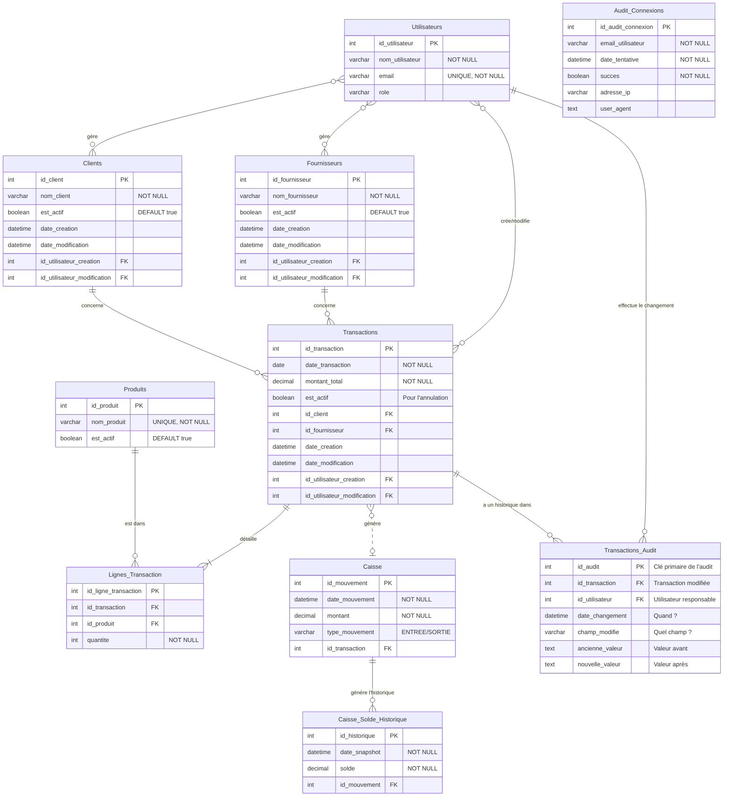

Absolument. C'est le moment de synthétiser l'ensemble de notre travail de conception en une documentation complète et unifiée. Ce document servira de feuille de route technique pour le développement de votre projet.

---

### **Documentation Complète du Projet : Digitalisation du Processus de Comptabilité**

#### **1. Contexte et Objectifs du Projet**

**1.1. Problématique Initiale**
Le processus comptable actuel de l'entreprise repose sur un fichier Excel pour le suivi des transactions impliquant trois entités principales : les Fournisseurs (débit), les Clients (crédit) et la Caisse. Cette méthode, bien que flexible, présente des risques significatifs en termes d'intégrité des données, de sécurité, de traçabilité des modifications et de limitations pour l'évolution future du système d'information.

**1.2. Objectifs**
Le projet vise à digitaliser et automatiser ce processus en développant une application web interne sécurisée, fiable et évolutive. Les objectifs principaux sont :
*   **Centraliser** les données dans une base de données relationnelle robuste.
*   **Sécuriser** l'accès et les modifications via un système d'authentification et de rôles.
*   **Garantir l'intégrité** des données grâce à des règles de validation strictes.
*   **Assurer une traçabilité inviolable** de toutes les modifications apportées aux transactions financières.
*   **Offrir une interface utilisateur (UI)** administrative efficace et intuitive pour la gestion, la consultation et l'analyse des données.
*   **Construire une fondation technique** prête à s'interconnecter avec de futurs services (gestion de stock, CRM, etc.).

---

#### **2. Architecture de la Base de Données**

La base de données est la pierre angulaire du système. Elle est conçue pour la robustesse, la traçabilité et la performance.

**2.1. Système de Gestion de Base de Données (SGBD)**
*   **Recommandation :** **PostgreSQL**. Pour sa robustesse, son respect des standards SQL et ses fonctionnalités avancées qui facilitent l'implémentation de logiques complexes comme les triggers.

**2.2. Schéma de la Base de Données (Mermaid)**
Ce schéma représente la structure finale et complète, incluant la gestion des utilisateurs et la piste d'audit.



**2.3. Concepts Clés de l'Architecture de Données**
*   **Tables `Clients` et `Fournisseurs` séparées :** Conformément à la spécificité du projet, les clients et fournisseurs sont gérés dans des tables distinctes.
*   **Suppression Logique (Soft Delete) :** La colonne `est_actif` permet de désactiver des enregistrements (transactions, clients...) sans jamais les supprimer physiquement, garantissant la conservation de l'historique.
*   **Traçabilité des Modifications :** Les colonnes `date_creation`, `date_modification` et `id_utilisateur_*` permettent de savoir qui a touché à un enregistrement et quand.
*   **Piste d'Audit Inviolable (`Transactions_Audit`) :** C'est le composant de sécurité le plus critique. Un **trigger** au niveau de la base de données enregistrera automatiquement **toute modification** effectuée sur une transaction dans cette table. Cet enregistrement est autonome (il contient l'ID de l'utilisateur) et immuable, garantissant un historique 100% fiable.
*   **Audit des Connexions (`Audit_Connexions`) :** Table dédiée pour tracer toutes les tentatives de connexion (réussies et échouées), avec l'adresse IP et le user agent, renforçant la sécurité du système.
*   **Gestion Avancée de la Caisse :** La colonne `type_mouvement` (ENTREE/SORTIE) clarifie le sens des flux financiers. La table `Caisse_Solde_Historique` permet de conserver un historique complet des variations de solde dans le temps.
*   **Contraintes Métier au Niveau Base de Données :** Des contraintes CHECK garantissent l'intégrité des données (montants positifs, exclusion mutuelle client/fournisseur) directement au niveau de PostgreSQL, indépendamment de l'application.
*   **Index de Performance :** Des index stratégiques sur les colonnes fréquemment requêtées garantissent des temps de réponse rapides même avec des volumes de données importants.

---

#### **3. Architecture Applicative (Stack Technique)**

L'application suivra une architecture moderne et découplée, garantissant flexibilité, performance et une expérience utilisateur optimale.

*   **Backend :** **FastAPI (Python)**. Pour sa rapidité de développement, ses performances exceptionnelles, sa validation de données intégrée via Pydantic et sa génération automatique de documentation.
*   **Frontend :** **React** ou **Vue.js (JavaScript/TypeScript)**. Pour un contrôle total sur l'UI/UX, la création d'interfaces réactives et l'accès à un riche écosystème de librairies de composants (MUI, Ant Design).
*   **Communication :** API RESTful avec authentification par **Tokens JWT**.

---

#### **4. Recommandations et Points d'Attention Critiques**

Cette section détaille les améliorations et clarifications importantes à intégrer dans le projet pour garantir sa robustesse, sa sécurité et sa maintenabilité.

**4.1. Sécurité - Renforcements Nécessaires**

Au-delà des mesures de base déjà prévues, les points suivants doivent être implémentés :

*   **✅ Hashage des mots de passe :** Déjà prévu via `passlib[bcrypt]`.
*   **⚠️ Rotation des tokens JWT (Refresh Tokens) :** Implémenter un système de refresh tokens pour permettre le renouvellement des tokens d'accès sans redemander les identifiants. Cela améliore la sécurité en réduisant la durée de vie des tokens d'accès (ex: 15 minutes) tout en maintenant la session utilisateur via un refresh token de plus longue durée (ex: 7 jours).
*   **⚠️ Rate Limiting :** Ajouter une protection contre les attaques par force brute en limitant le nombre de requêtes par IP/utilisateur. Utiliser la librairie `slowapi` pour FastAPI.
*   **⚠️ Protection CSRF :** Pour les opérations sensibles, envisager l'ajout de tokens CSRF, bien que JWT offre déjà une certaine protection.
*   **⚠️ Logs de sécurité :** Mettre en place un système de logging structuré pour enregistrer toutes les tentatives de connexion (réussies et échouées), les accès refusés, et les actions critiques.

**Dépendances supplémentaires recommandées :**
```
slowapi  # Rate limiting
python-multipart  # Pour le parsing des formulaires
```

**4.2. Base de Données - Contraintes et Index**

**Contraintes Métier Critiques :**
Les contraintes suivantes doivent être ajoutées au schéma pour garantir l'intégrité des données :

```sql
-- Montant toujours positif
ALTER TABLE Transactions 
ADD CONSTRAINT check_montant_positif 
CHECK (montant_total > 0);

-- Une transaction concerne SOIT un client, SOIT un fournisseur (exclusion mutuelle)
ALTER TABLE Transactions 
ADD CONSTRAINT check_client_ou_fournisseur 
CHECK (
  (id_client IS NOT NULL AND id_fournisseur IS NULL) 
  OR 
  (id_fournisseur IS NOT NULL AND id_client IS NULL)
);

-- Quantité dans les lignes de transaction doit être positive
ALTER TABLE Lignes_Transaction 
ADD CONSTRAINT check_quantite_positive 
CHECK (quantite > 0);
```

**Optimisation des Performances :**
Créer des index sur les colonnes fréquemment requêtées :

```sql
-- Index pour accélérer les recherches et les jointures
CREATE INDEX idx_transactions_date ON Transactions(date_transaction);
CREATE INDEX idx_transactions_client ON Transactions(id_client);
CREATE INDEX idx_transactions_fournisseur ON Transactions(id_fournisseur);
CREATE INDEX idx_transactions_actif ON Transactions(est_actif);
CREATE INDEX idx_audit_transaction ON Transactions_Audit(id_transaction);
CREATE INDEX idx_audit_date ON Transactions_Audit(date_changement);
```

**Extension Future :**
Si les transactions peuvent être réglées par d'autres moyens que la caisse (virement, chèque, carte), envisager l'ajout d'une table `Moyens_Paiement`.

**4.3. Gestion de la Caisse - Clarifications et Améliorations**

**Réponses aux Questions Métier :**
1. **Un mouvement de caisse est-il TOUJOURS lié à une transaction ?** Oui.
2. **Peut-on avoir des mouvements de caisse indépendants ?** Non (dans la version actuelle).
3. **Comment gérer le solde de la caisse ?** Via calcul sur la table Caisse.
4. **Faut-il une table d'historique du solde ?** Oui, recommandé.

**Améliorations Recommandées :**

Ajouter une colonne `type_mouvement` pour clarifier le sens du flux :

```sql
-- Modification de la table Caisse
ALTER TABLE Caisse 
ADD COLUMN type_mouvement VARCHAR(10) CHECK (type_mouvement IN ('ENTREE', 'SORTIE'));
```

**Créer une vue matérialisée pour le solde en temps réel :**

```sql
CREATE MATERIALIZED VIEW Vue_Solde_Caisse AS
SELECT 
    COALESCE(SUM(CASE WHEN type_mouvement = 'ENTREE' THEN montant ELSE 0 END), 0) -
    COALESCE(SUM(CASE WHEN type_mouvement = 'SORTIE' THEN montant ELSE 0 END), 0) as solde_actuel,
    MAX(date_mouvement) as derniere_maj
FROM Caisse;

-- Créer un index sur cette vue
CREATE UNIQUE INDEX idx_solde_caisse ON Vue_Solde_Caisse(solde_actuel);
```

**Table d'Historique du Solde (optionnel mais recommandé) :**

```sql
CREATE TABLE Caisse_Solde_Historique (
    id_historique SERIAL PRIMARY KEY,
    date_snapshot TIMESTAMP NOT NULL DEFAULT CURRENT_TIMESTAMP,
    solde DECIMAL(15,2) NOT NULL,
    id_mouvement INT REFERENCES Caisse(id_mouvement)
);
```

**4.4. Audit et Traçabilité - Extensions**

Le système d'audit prévu est solide. Pour aller plus loin :

*   **Logs applicatifs structurés :** Implémenter un système de logging avancé avec Python `logging` et envisager une stack ELK (Elasticsearch, Logstash, Kibana) ou Loki/Grafana pour l'analyse.
*   **Audit des connexions :** Enregistrer toutes les tentatives de connexion (succès/échec) dans une table dédiée `Audit_Connexions`.
*   **Audit des consultations :** Pour les données sensibles, tracer qui consulte quoi et quand.
*   **Sauvegardes automatiques :** Mettre en place un système de backup quotidien automatique de la base PostgreSQL via `pg_dump` et stockage sécurisé.

**Exemple de table Audit_Connexions :**

```sql
CREATE TABLE Audit_Connexions (
    id_audit_connexion SERIAL PRIMARY KEY,
    email_utilisateur VARCHAR(255) NOT NULL,
    date_tentative TIMESTAMP NOT NULL DEFAULT CURRENT_TIMESTAMP,
    succes BOOLEAN NOT NULL,
    adresse_ip VARCHAR(45),
    user_agent TEXT
);
```

**4.5. Fonctionnalités Frontend - Recommandations UX**

Pour offrir une expérience utilisateur optimale, intégrer les fonctionnalités suivantes :

*   **Notifications en temps réel :** Utiliser WebSocket ou Server-Sent Events (SSE) pour notifier les utilisateurs des événements importants (nouvelle transaction, alerte solde, etc.).
*   **Export Excel/PDF :** Permettre l'export des rapports et listes pour faciliter la transition depuis Excel. Librairies recommandées : `xlsx` (Excel), `jsPDF` (PDF).
*   **Tableau de bord analytique :** Intégrer des graphiques interactifs avec `recharts` ou `chart.js` pour visualiser l'évolution des transactions, du solde, des top clients/fournisseurs.
*   **Filtres avancés et recherche :** Implémenter des filtres multiples (par date, montant, client, statut) et une recherche full-text performante.
*   **Validation en temps réel :** Utiliser `React Hook Form` ou `Formik` avec validation Yup pour un feedback instantané sur les formulaires.
*   **Mode responsive :** Assurer la compatibilité mobile/tablette pour la consultation (pas nécessairement l'édition).

**Librairies Frontend Recommandées :**
```json
{
  "axios": "^1.6.0",
  "react-router-dom": "^6.20.0",
  "@mui/material": "^5.14.0",
  "recharts": "^2.10.0",
  "react-hook-form": "^7.48.0",
  "yup": "^1.3.0",
  "xlsx": "^0.18.5",
  "jspdf": "^2.5.1",
  "date-fns": "^2.30.0"
}
```

**4.6. Tests et Qualité - Stratégie Complète**

La section tests doit être significativement enrichie :

**Backend :**
*   **Tests unitaires :** Tester les fonctions métier et la logique de validation (Pytest).
*   **Tests d'intégration :** Vérifier le comportement complet des endpoints API (déjà prévu).
*   **Tests de charge :** Utiliser Locust ou K6 pour simuler des charges importantes et identifier les goulots d'étranglement.
*   **Tests de sécurité :** Vérifier la conformité OWASP Top 10 (injections SQL, XSS, CSRF, etc.).
*   **Coverage :** Viser minimum 80% de couverture de code.

**Frontend :**
*   **Tests unitaires :** Composants et fonctions utilitaires avec Jest et React Testing Library.
*   **Tests end-to-end (E2E) :** Scénarios utilisateur complets avec Playwright ou Cypress.
*   **Tests d'accessibilité :** Vérifier la conformité WCAG avec `axe-core`.
*   **Tests de régression visuelle :** Optionnel mais utile (Percy, Chromatic).

**Outils et Commandes :**
```bash
# Backend
pip install pytest pytest-cov pytest-asyncio locust

# Frontend  
npm install --save-dev @testing-library/react @testing-library/jest-dom
npm install --save-dev @playwright/test
npm install --save-dev @axe-core/react
```

**4.7. Documentation et Formation**

Points souvent négligés mais critiques pour le succès du projet :

*   **Documentation API :** ✅ Générée automatiquement par FastAPI (Swagger/ReDoc).
*   **Documentation utilisateur :** Créer un guide d'utilisation illustré pour les comptables (format PDF ou page web).
*   **Runbooks :** Documenter les procédures en cas d'incident (base de données corrompue, perte de connexion, etc.).
*   **Plan de formation :** Prévoir des sessions de formation pour accompagner les utilisateurs dans la transition Excel → Application web.
*   **Vidéos tutorielles :** Créer des screencast courts pour les opérations courantes.

---

### **Plan d'Action Détaillé pour le Développement**

#### **Phase 0 : Préparation de l'Environnement**

1.  **Structure du Projet :** Créer un dépôt Git avec deux dossiers : `backend` et `frontend`.
2.  **Outils :** Installer Python 3.10+, Node.js (LTS), Docker, VS Code.
3.  **Base de Données :** Lancer une instance PostgreSQL via Docker.

#### **Phase 1 : Développement du Backend (FastAPI)**

1.  **Initialisation :**
    *   Créer un environnement virtuel (`venv`).
    *   Installer les dépendances : `fastapi`, `uvicorn`, `sqlalchemy`, `alembic` (migrations), `pydantic`, `psycopg2-binary`, `python-dotenv`, `passlib[bcrypt]` (hashage mdp), `python-jose[cryptography]` (JWT), `slowapi` (rate limiting), `python-multipart` (parsing formulaires), `pytest`, `pytest-cov`, `pytest-asyncio` (tests).

2.  **Modélisation & Migration :**
    *   Traduire le schéma en modèles SQLAlchemy dans un fichier `models.py`.
    *   Initialiser Alembic pour gérer les migrations de la base de données. Créer la première migration pour générer toutes les tables.
    *   Créer une migration pour ajouter les **contraintes métier** (check_montant_positif, check_client_ou_fournisseur, check_quantite_positive).
    *   Créer une migration pour ajouter les **index de performance** sur les colonnes fréquemment requêtées.
    *   Créer les tables supplémentaires : `Audit_Connexions` et `Caisse_Solde_Historique`.
    *   Ajouter la colonne `type_mouvement` à la table Caisse pour distinguer les entrées et sorties.

3.  **Validation des Données (Pydantic) :**
    *   Créer un fichier `schemas.py` pour définir les "formes" des données attendues par l'API (ex: `TransactionCreate`, `UserRead`). Pydantic assurera que seules des données valides peuvent entrer dans le système.

4.  **Développement des Endpoints de l'API :**
    *   Créer les routers pour chaque ressource (`transactions.py`, `users.py`, etc.).
    *   Implémenter les endpoints CRUD pour toutes les ressources.
    *   **Configuration CORS :** Configurer FastAPI pour autoriser les requêtes provenant du domaine du frontend.

5.  **Sécurité : Authentification (JWT) et Autorisation :**
    *   Créer un endpoint `/login` qui prend un email/mot de passe, les vérifie contre la base de données (mot de passe hashé) et retourne un token JWT d'accès (durée: 15 min) et un refresh token (durée: 7 jours).
    *   Créer un endpoint `/refresh` pour renouveler le token d'accès via le refresh token sans redemander les identifiants.
    *   Créer une dépendance FastAPI (`get_current_user`) qui sera utilisée pour protéger les routes. Cette fonction lira le token JWT depuis l'en-tête `Authorization`, le validera et retournera l'utilisateur correspondant.
    *   Implémenter une logique de rôles pour restreindre l'accès à certains endpoints (ex: seul un `admin` peut accéder au router des utilisateurs).
    *   **Rate Limiting :** Configurer `slowapi` pour limiter les tentatives de connexion (ex: 5 tentatives par minute par IP).
    *   **Logging de sécurité :** Enregistrer toutes les tentatives de connexion dans la table `Audit_Connexions`.

6.  **Mise en Place du Trigger d'Audit :**
    *   Écrire la fonction SQL et le trigger de l'audit pour PostgreSQL.
    *   Créer une migration Alembic pour appliquer ce trigger à la base de données.

#### **Phase 2 : Développement du Frontend (React/Vue)**

1.  **Initialisation :**
    *   Utiliser `Vite` pour créer le projet React ou Vue.
    *   Installer les dépendances : `axios`, `react-router-dom`, et une librairie de composants comme **Material-UI (MUI)**.

2.  **Connexion Sécurisée à l'API :**
    *   Créer un service `api.js` (ou similaire) utilisant `axios`.
    *   Mettre en place un "intercepteur" `axios` qui attache automatiquement le token JWT (stocké dans le `localStorage` ou `sessionStorage` après la connexion) à chaque requête sortante.

3.  **Gestion de l'État et des Routes :**
    *   Configurer `react-router-dom` pour définir les différentes pages de l'application (Login, Dashboard, Transactions, etc.) et créer des routes protégées qui redirigent vers la page de connexion si l'utilisateur n'est pas authentifié.
    *   Utiliser un outil de gestion d'état simple comme `Zustand` ou `Context API` pour gérer l'état global (ex: informations de l'utilisateur connecté).

4.  **Construction des Composants et Pages :**
    *   Développer des composants réutilisables (`DataGrid`, `ModalForm`, `StatCard`).
    *   Assembler les pages en utilisant ces composants, en respectant le design UI/UX défini (dashboard, listes filtrables, pages de profil 360°, écran d'audit).
    *   **Validation des Formulaires :** Utiliser une librairie comme `Formik` ou `React Hook Form` pour fournir un retour instantané à l'utilisateur sur les formulaires, en complément de la validation backend.

#### **Phase 3 : Finalisation, Migration et Déploiement**

1.  **Configuration et Secrets :**
    *   Utiliser des fichiers `.env` à la racine des dossiers `backend` et `frontend` pour stocker les configurations (URL de la base de données, clé secrète JWT, URL de l'API). Ces fichiers ne doivent **jamais** être commités sur Git.

2.  **Tests :**
    *   **Backend :** Tests d'intégration avec `Pytest` pour vérifier le comportement des endpoints, la sécurité et la logique métier.
    *   **Frontend :** Tests unitaires des composants critiques avec `Jest` et `React Testing Library`.

4.  **Dockerisation et Déploiement :**
    *   Créer un `Dockerfile` pour le backend FastAPI.
    *   Créer un `Dockerfile` en plusieurs étapes (multi-stage) pour le frontend React afin de servir les fichiers statiques via un serveur léger comme Nginx.
    *   Créer un fichier `docker-compose.yml` pour orchestrer le lancement de tous les services (PostgreSQL, Backend, Frontend) d'une seule commande.
    *   Configurer un système de **sauvegarde automatique** de la base de données (cron + pg_dump).
    *   Mettre en place le monitoring des logs et des performances.

---

### **Estimation du Projet et Recommandations**

#### **5.1. Estimation Temporelle**

Pour un développeur fullstack expérimenté travaillant seul sur ce projet :

| Phase | Durée Estimée | Détails |
|-------|---------------|---------|
| **Phase 0** : Préparation | 2-3 jours | Configuration de l'environnement, Docker, structure Git |
| **Phase 1** : Backend | 3-4 semaines | Modèles, API, authentification, audit, tests |
| **Phase 2** : Frontend | 3-4 semaines | UI/UX, composants, intégration API, dashboards |
| **Phase 3** : Tests & Déploiement | 2 semaines | Tests approfondis, Docker, documentation |
| **Formation utilisateurs** | 1 semaine | Guides, vidéos, sessions pratiques |
| **Total** | **2-3 mois** | Pour un MVP production-ready |

**Note :** Cette estimation suppose un travail à temps plein et une expérience solide avec les technologies mentionnées.

#### **5.2. Priorités de Développement**

Pour un déploiement itératif, nous recommandons la stratégie suivante :

**MVP (Version 1.0 - Essentiel) :**
- ✅ CRUD complet (Clients, Fournisseurs, Transactions, Produits)
- ✅ Authentification JWT + gestion des rôles
- ✅ Système d'audit des transactions (trigger)
- ✅ Dashboard basique avec statistiques clés
- ✅ Gestion de la caisse avec calcul du solde
- ✅ Export Excel simple

**Version 1.5 (Améliorations Sécurité) :**
- 🔒 Refresh tokens
- 🔒 Rate limiting
- 🔒 Audit des connexions
- 🔒 Logs structurés

**Version 2.0 (Fonctionnalités Avancées) :**
- 📊 Graphiques analytiques avancés
- 📄 Export PDF personnalisés
- 🔍 Recherche full-text
- 📱 Notifications en temps réel
- 🌐 Mode responsive optimisé

**Version 2.5 (Optimisation & Évolution) :**
- ⚡ Tests de charge et optimisations
- 🔌 APIs pour intégration externe
- 💾 Système de backup automatisé avancé
- 📈 Dashboard BI avancé

#### **5.3. Facteurs de Réussite Critiques**

1. **Implication des Utilisateurs Finaux**
   - Recueillir leurs retours dès le prototype
   - Les impliquer dans la validation de l'UI/UX
   - Former progressivement pendant le développement

2. **Qualité des Données Initiales**
   - Nettoyer et valider les données Excel avant migration
   - Prévoir un script de migration robuste avec gestion d'erreurs
   - Tester la migration sur un échantillon

3. **Accompagnement au Changement**
   - Ne pas sous-estimer la résistance au changement
   - Maintenir Excel en parallèle pendant une période de transition
   - Désigner un "super-utilisateur" interne comme relais

4. **Documentation Continue**
   - Documenter au fur et à mesure du développement
   - Tenir à jour le README technique
   - Créer des guides utilisateurs illustrés

#### **5.4. Risques et Mitigations**

| Risque | Impact | Probabilité | Mitigation |
|--------|--------|-------------|------------|
| Résistance utilisateurs | Élevé | Moyenne | Formation, implication précoce, période de transition |
| Qualité données source | Élevé | Moyenne | Validation et nettoyage avant migration |
| Dérive du périmètre | Moyen | Élevée | Définir MVP strict, approche itérative |
| Bugs de sécurité | Élevé | Faible | Tests de sécurité, audit de code, rate limiting |
| Performance insuffisante | Moyen | Faible | Index appropriés, tests de charge, monitoring |

---

### **Conclusion**

Ce projet de digitalisation est **ambitieux mais réaliste** avec une approche méthodique et itérative. La documentation fournie constitue une feuille de route complète qui, si suivie rigoureusement, aboutira à une solution robuste, sécurisée et évolutive.

**Points clés à retenir :**
- L'architecture proposée est solide et suit les meilleures pratiques de l'industrie
- Les recommandations de sécurité sont essentielles et ne doivent pas être négligées
- L'approche MVP permet de livrer rapidement de la valeur tout en itérant
- Le succès dépendra autant de la technique que de l'accompagnement humain

**Prochaines Étapes Immédiates :**
1. Valider cette documentation avec les parties prenantes
2. Préparer l'environnement de développement (Phase 0)
3. Créer le dépôt Git et initialiser la structure du projet
4. Commencer par le backend (base solide pour tout le reste)

**Bonne chance dans ce projet ! 🚀**
